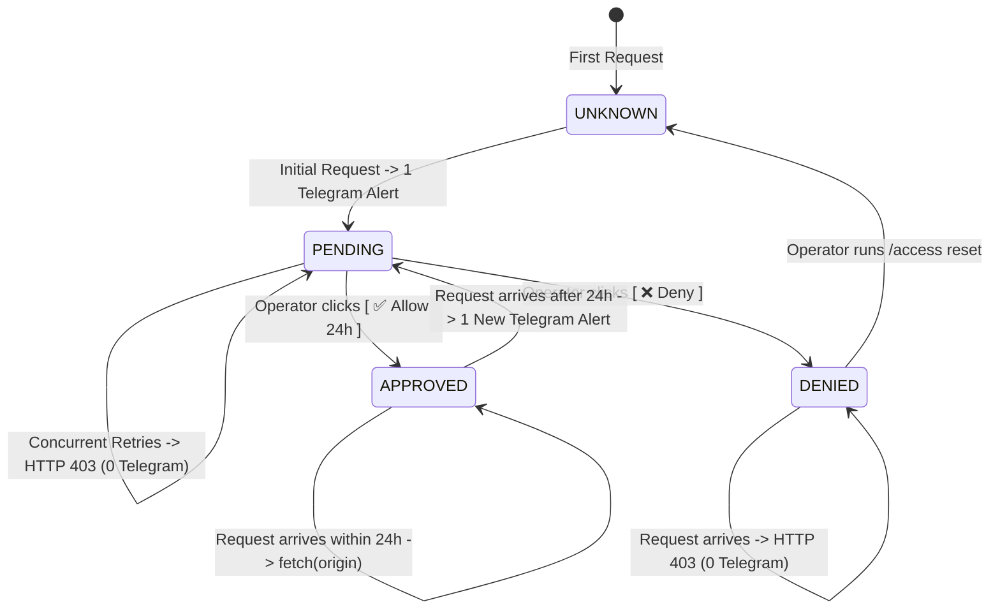

# Cloudflare Edge Approval Gateway

> **Zero-Origin Overhead Approval Architecture with SQLite Durable Objects & Telegram Decision Plane.**

This document describes the design, deployment, configuration, operational procedures, and emergency runbooks for the **OmniRoute Cloudflare Edge Approval Gateway**.

---

## 1. Overview & Problem Solved

When running an AI proxy with high-concurrency coding agents (Claude Code, Codex CLI, Cursor, etc.), unapproved or unauthorized clients can easily flood the origin infrastructure with retry storms (hundreds or thousands of parallel HTTP requests).

The **Edge Approval Gateway** moves access gating to the Cloudflare Edge network:

```
[ Client: Claude Code / Codex / Cursor ]
                   │
                   ▼ (1) HTTPS Request
       [ Cloudflare DDoS / WAF ]
                   │
                   ▼ (2)
┌─────────────────────────────────────────────────────────────┐
│  Cloudflare Ingress Worker (Pipeline Orchestrator)          │
│                                                             │
│  1. Classify Route (Public / Dashboard / Client API)        │
│  2. Extract Credential (Bearer / x-api-key / Path Token)    │
│  3. Verify Key v2 Signature: HMAC-SHA256 (128-bit MAC)      │
└──────────────────────────────┬──────────────────────────────┘
                               │ (Key signature valid)
                               ▼ (3)
┌─────────────────────────────────────────────────────────────┐
│  SQLite Durable Object (1 Object per SHA256 Key Hash)       │
│                                                             │
│  • UNKNOWN / EXPIRED ──▶ PENDING (Atomic epoch rollover)   │
│                          └──▶ Send 1 Alert via Telegram API │
│  • PENDING (Retries) ──▶ 403 Forbidden (0 Telegram, 0 VPS) │
│  • DENIED            ──▶ 403 Forbidden (0 Telegram, 0 VPS) │
│  • APPROVED (< 24h)  ──▶ fetch(originRequest)              │
└──────────────────────────────┬──────────────────────────────┘
                               │ (APPROVED)
                               ▼ (4) fetch(request) non-buffered
                   [ Cloudflare Tunnel ]
                               │
                               ▼
                        [ Caddy :8080 ]
                  (flush_interval -1, SSE/WS)
                               │
                               ▼
                   [ OmniRoute Blue/Green ]
            (REQUIRE_API_KEY=true, DB Auth & Quotas)
```

### Key Guarantees

- **Zero Origin Load for Unapproved Requests**: Requests that are pending, denied, or presenting invalid/random tokens are terminated at the Cloudflare edge with `403 Forbidden`. Zero requests reach Cloudflare Tunnel, Caddy, or the VPS.
- **Strict Anti-Spam Notification Guarantee**: Atomic state transitions inside SQLite Durable Objects ensure that even with 1,000+ parallel requests, exactly **1 Telegram alert** is sent to the operator for each pending approval cycle.
- **Unbuffered Streaming**: Approved traffic is forwarded using raw `fetch(request)` streaming, preserving low TTFT (Time To First Token) for SSE `/v1/chat/completions`, `/v1/responses`, and WebSocket channels.
- **Defence-in-Depth**: OmniRoute retains `REQUIRE_API_KEY=true` and validates keys against SQLite/Redis for model allowlists, connection quotas, rates, and active bans.

---

## 2. Cryptographic Key Format (Key v2)

The gateway authenticates client identity without storing raw keys by enforcing cryptographic signatures at the edge:

### Key v2 Format (128-Bit MAC)

$$\texttt{sk-v2-\{keyId\}-\{mac32\}}$$

- `v2`: Explicit version tag.
- `keyId`: 12-hex character CSPRNG key identifier.
- `mac32`: 32-hex character (128-bit) truncated HMAC-SHA256 computed as:
  $$\text{mac32} = \text{HMAC-SHA256}_{\text{EDGE\_API\_KEY\_SIGNING\_SECRET}}(\texttt{"v2:"} \parallel \text{keyId})[0..32]$$

### Client Credential Transports

The Edge Gateway extracts credentials in accordance with OmniRoute standards:

1. `Authorization: Bearer <key>`
2. `x-api-key: <key>`
3. `x-goog-api-key: <key>` (Gemini CLI compatibility)
4. Path token: `/api/v1/vscode/{token}/...`

---

## 3. SQLite Durable Object Lifecycle

Each client API key maps to an isolated Durable Object instance named by the SHA-256 hash of the full key:
$$\text{clientId} = \text{SHA256}(\text{raw\_api\_key})$$

### State Machine



---

## 4. Telegram Ops Bot Integration

The gateway integrates directly with the existing host systemd bot (`omniroute-ops-bot.service`):

### Alert Card Layout (Telegram HTML)

```html
🔐 <b>New OmniRoute API Access Request</b>

<b>Client:</b> <code>sk-v2-a3f8****</code> <b>Key ID:</b> <code>a3f891b2c4e0</code>
<b>Client Hash:</b> <code>73698dc7...</code>

<b>IP:</b> <code>14.162.x.x</code> <b>Country:</b> 🇻🇳 VN <b>Endpoint:</b>
<code>POST /v1/responses</code> <b>User-Agent:</b> <code>codex_cli_rs/0.1.0</code>
<b>First Seen:</b> <code>26/08/2026 10:45:12 UTC</code>

<b>Status:</b> ⏳ <b>PENDING APPROVAL</b>
```

### Inline Interactive Buttons

- `[ ✅ Allow 24h ]`: Approves client traffic for 24 hours. The bot posts a signed decision to `/__edge-control/decision` and edits the message in place.
- `[ ❌ Deny ]`: Persistently denies access. Subsequent requests are blocked with zero alerts.
- `[ ♻️ Reset ]`: Deletes the Durable Object state, allowing the client to re-prompt for approval on the next request.

### Signed Decision Protocol

Requests from the bot to the edge control endpoint require HMAC-SHA256 authentication:

- **Header `X-Edge-Timestamp`**: Unix timestamp in seconds (valid within $\pm 300\text{s}$).
- **Header `X-Edge-Nonce`**: 32-character random nonce.
- **Header `X-Edge-Signature`**: $\text{HMAC-SHA256}_{\text{EDGE\_CONTROL\_SECRET}}(\text{Timestamp} \parallel \texttt{"."} \parallel \text{Nonce} \parallel \texttt{"."} \parallel \text{RawBody})$.

---

## 5. Deployment & Configuration Guide

### 5.1 Environment Variables & Secrets

#### Cloudflare Worker Encrypted Secrets

Set via Wrangler CLI or Cloudflare Dashboard:

- `EDGE_API_KEY_SIGNING_SECRET`: Secret used to verify Key v2 128-bit MAC signatures.
- `EDGE_CONTROL_SECRET`: Secret used to authenticate decision requests from the Ops Bot.
- `TELEGRAM_BOT_TOKEN`: Telegram bot token from `@BotFather`.
- `TELEGRAM_CHAT_ID`: Operator numeric chat ID for approval notifications.

#### VPS `.app.env` (`/opt/omniroute/.app.env`)

```bash
EDGE_API_KEY_SIGNING_SECRET=<same-secret-as-worker>
```

#### VPS Ops Bot Environment (`/etc/omniroute/ops-bot.env`)

```bash
OPS_EDGE_PUBLIC_URL=https://api.yourdomain.com
OPS_EDGE_CONTROL_SECRET=<same-secret-as-worker>
```

### 5.2 Deploying the Cloudflare Worker

```bash
cd infra/cloudflare/approval-gateway
npm install
npm run test
npx wrangler deploy
```

---

## 6. Verification & Testing Matrix

Run the automated test suites:

```bash
# Test Cloudflare Worker components (Crypto, Routes, Control Protocol)
cd infra/cloudflare/approval-gateway
npm run test

# Test Telegram Ops Bot Edge Integration
python3 -m unittest discover -s tests/unit/ops -t . -v

# Test Core OmniRoute Key v2 Compatibility
node --import tsx/esm --test tests/unit/api-key-v2.test.ts
```

---

## 7. Emergency Rollback Procedures

If edge traffic needs to bypass approval immediately:

### Option A: Instant Pass-Through Mode (Under 10 Seconds)

Deploy an environment variable override:

```bash
npx wrangler deploy --env production --var ENFORCE_APPROVAL:false
```

### Option B: Cloudflare Worker Rollback

Roll back to a prior published version in one command:

```bash
npx wrangler rollback <VERSION_ID>
```

### Option C: DNS / Tunnel Direct Cutover

In Cloudflare Zero Trust Dashboard -> Tunnels: point `api.<domain>` directly to `http://caddy:8080` without passing through the Worker route.
